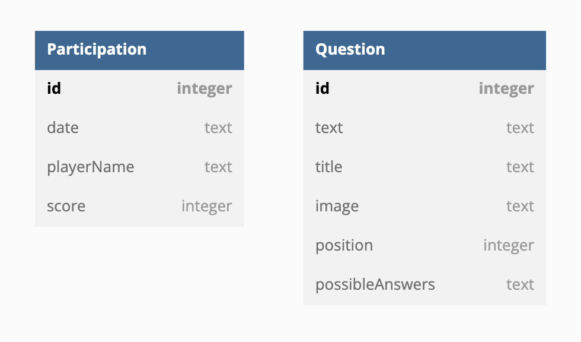

# E4_quizz_app

## Schéma de la base de données


## Lancer les images de prod
 ```
docker container run -it --rm -p 5000:5000 --name quiz-prod-api tqnlp/quiz-prod-api
docker container run -it --rm -p 3000:80 --name quiz-prod-ui tqnlp/quiz-prod-ui
```